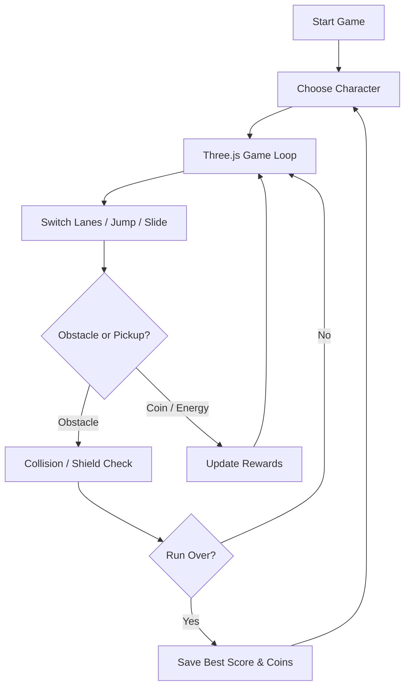

<div align="center">


# ❄️ POLAR DASH
### Run. Jump. Slide. Survive the Frozen Frontier.

**A stylized, procedural 3D Arctic endless-runner game built with Three.js, JavaScript and Vite.**

[](https://threejs.org/)
[](https://developer.mozilla.org/docs/Web/JavaScript)
[](https://vite.dev/)
[](https://capacitorjs.com/)

[](https://github.com/mothinisuresh14072002/penguin-game/actions/workflows/build.yml)
[](https://github.com/mothinisuresh14072002/penguin-game/stargazers)

**[🎮 Run Locally](#-quick-start) · [🐧 Characters](#-meet-the-runners) · [🧊 Gameplay](#-gameplay) · [📱 Android](#-android-build-prototype) · [🛠️ Roadmap](#-roadmap)**

</div>

---

## 🌌 Welcome to the Frozen Frontier

*The ice never ends. The speed never stops.*

**Polar Dash** sends a cast of animal adventurers sprinting through an endless frozen landscape. Weave between lanes, jump over ice spikes, slide through tricky sections, collect coins, replenish your energy and chase your best distance.

The world and characters are generated with **procedural Three.js geometry**, not prebuilt downloadable character models. This is an **open-source, playable prototype** with a mobile-oriented interface—not yet a fully tested or published Play Store release.

<div align="center">

| 🧊 Endless ice | ⚡ Energy survival | 🪙 Collect & unlock | 🛡️ Power-ups |
|:---:|:---:|:---:|:---:|
| Three-lane running | Grab energy pickups | Unlock new characters | Shield & coin magnet |

</div>

## 🎮 Gameplay

| Feature | Current implementation |
|---|---|
| **Infinite run** | Procedural obstacles and increasing movement speed |
| **Movement** | Switch between three lanes, jump and slide |
| **Hazards** | Ice rocks, spikes, barriers and lion enemies |
| **Energy** | Energy decreases during a run; green pickups refill it |
| **Rewards** | Collect coins and spend them in the character shop |
| **Power-ups** | Shield and temporary coin magnet |
| **Progress** | Best distance, coins and unlocked characters stored locally |
| **Controls** | Keyboard and mobile swipe gestures |
| **Audio** | Optional, lightweight synthesized gameplay effects |

## 🐾 Meet the Runners

<div align="center">

| 🐧 Pip | 🦊 Frost | 🦭 Splash | 🐻‍❄️ Boris | 👑 Royal Penguin |
|:---:|:---:|:---:|:---:|:---:|
| Penguin | Fox | Seal | Polar Bear | Penguin |
| **Free** | **120 coins** | **260 coins** | **450 coins** | **700 coins** |

*Character prices refer to in-game coins earned while playing, not real-money purchases.*

</div>

## ✨ Three.js Visual Experience

<table>
<tr>
<td width="50%">

### 🌨️ Procedural Frozen World

- Arctic mountains and glacier cliffs
- Snow-covered track sections
- Generated ice formations and hazards
- Animated falling snow
- Fog, lighting, shadows and tone mapping

</td>
<td width="50%">

### 🐧 Animated 3D Characters

- Multiple original animal designs
- Character movement and flipper animation
- Jump and slide motion
- Smooth-follow camera
- Runtime mesh generation

</td>
</tr>
</table>

**About the animation:** the illustrated banner at the top is an SVG animation. The **real-time 3D gameplay** runs through Three.js when the project is launched. GitHub does not execute interactive WebGL/Three.js inside a README. The models are currently stylized procedural prototypes, not photorealistic production assets.

> 📸 **Gameplay preview:** An actual recorded gameplay GIF or screenshot will be added after a successful browser/device capture. This README intentionally does not present concept art as a real in-game screenshot.

## 🚀 Quick Start

**Requirements:** Node.js and npm. Use CMD or the integrated terminal in VS Code / Antigravity.

```cmd
git clone https://github.com/mothinisuresh14072002/penguin-game.git
cd penguin-game
npm install
npm run dev
```

Then open **http://localhost:5173/** (or the address displayed by Vite).

### 🎮 Controls

| Action | Windows / Keyboard | Phone / Tablet |
|---|---|---|
| Switch left or right | `A` / `D` or `←` / `→` | Swipe left / right |
| Jump | `W`, `Space`, `↑` | Swipe up / tap |
| Slide | `S`, `↓` | Swipe down |
| Pause | `P` | Pause button |
| Sound effects | Sound toggle | Sound toggle |

### Build for Web

```cmd
npm run build
npm run preview
```

The optimized web output is generated in `dist/`.

## 🏗️ Project Architecture

```text
penguin-game/
├── .github/
│   └── workflows/build.yml     # GitHub Actions build checks
├── assets/
│   └── readme-banner.svg       # Animated README banner
├── docs/
│   └── PLAY_STORE_RELEASE.md   # Android release checklist
├── src/
│   ├── main.js                 # Three.js scene + gameplay systems
│   └── style.css               # Game UI and responsive styles
├── index.html                  # Game interface
├── package.json                # Dependencies and scripts
├── capacitor.config.json      # Android app wrapper configuration
├── PRIVACY.md                  # Prototype privacy notes
└── README.md
```

### How It Works



## 📱 Android Build (Prototype)

This repository includes **Capacitor** configuration for building an Android wrapper around the web game. Install **Android Studio**, an Android SDK and a compatible JDK.

```cmd
npm install
npm run build
npm run android:add
npm run android:sync
npm run android:open
```

**Note:** Run `npm run android:add` only for the first Android project creation. For later updates, use `npm run android:sync`.

The game **has not yet been signed, published or confirmed through a complete Android device-test cycle**. For release requirements, see **[Google Play release guide](docs/PLAY_STORE_RELEASE.md)** and **[Privacy notes](PRIVACY.md)**.

## 🗺️ Roadmap

- [x] Procedural 3D Arctic environment
- [x] Three-lane running, jumping and sliding
- [x] Five selectable / unlockable animal characters
- [x] Coins, energy, shields and magnets
- [x] Local progress saving and basic audio cues
- [x] Capacitor Android configuration
- [x] GitHub Actions build workflow added
- [ ] Verify the production build and automate gameplay tests
- [ ] Higher-fidelity character meshes, textures and skeletal animation
- [ ] Device-tested 60 FPS performance targets and graphical quality presets
- [ ] Additional levels, biomes, missions and onboarding
- [ ] Capture authentic gameplay footage, screenshots and trailer
- [ ] Sign, test and submit the Android App Bundle to Google Play

## 🤝 Contributing

Contributions, bug reports and improvements are welcome. Feel free to [open an issue](https://github.com/mothinisuresh14072002/penguin-game/issues) or submit a pull request.

## 👩‍💻 Project Author

Developed and maintained by **[Mothini S.](https://github.com/mothinisuresh14072002)**.

<div align="center">

---

### ❄️ Every Run Is a New Adventure

**Made with Three.js · Built for the Frozen Frontier**

[⬆ Back to Top](#️-polar-dash)

</div>
