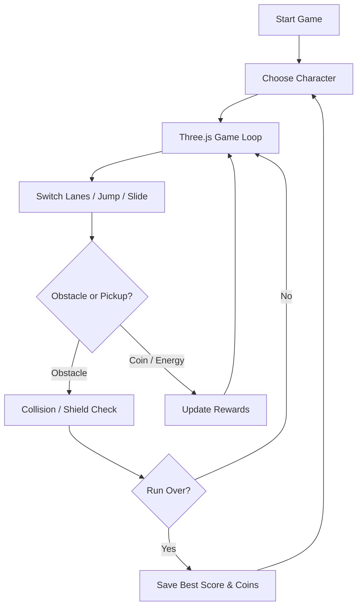

<div align="center">



# ❄️ POLAR DASH
### Seven Cute Heroes · Seven Living Worlds · Two-Friend Races

**Fast 3D animal endless runner with a solo adventure and same-screen, two-player split-screen races. Built using Three.js and Vite.**

[](https://threejs.org/)
[](https://developer.mozilla.org/docs/Web/JavaScript)
[](https://vite.dev/)
[](https://capacitorjs.com/)

[](https://github.com/mothinisuresh14072002/penguin-game/actions/workflows/build.yml)
[](https://github.com/mothinisuresh14072002/penguin-game/stargazers)

**[🎮 Play](#-quick-start) · [🏁 Two Friends](#-two-friend-split-screen-race) · [🐾 Characters](#-meet-the-runners-and-their-worlds) · [✨ Three.js](#-threejs-visual-experience) · [📱 Android](#-android-build-prototype)**

</div>

---

## 🌈 Welcome to the Animal Worlds

*Pick your animal. Explore its world. Keep running!* 

**Polar Dash** is a playful 3D endless runner featuring seven cute animals and seven character-linked environments. Choose Bella Bunny for a flower meadow, Ula Unicorn for pastel magic, Pip Penguin for a frozen glacier, or one of the other animal friends. Switch lanes, jump, slide, gather coins and energy, and chase your personal best.

The world and characters are generated with **procedural Three.js geometry**, not prebuilt downloadable character models. This is an **open-source, playable prototype** with a mobile-oriented interface—not yet a fully tested or published Play Store release.

<div align="center">

| 🌈 Seven themed worlds | 🏁 Two-player races | ⚡ Speed & energy | 🪙 Collect & unlock |
|:---:|:---:|:---:|:---:|
| Character-linked nature | Same-screen split view | Faster progression | Earn coins in solo |

</div>

## 🎮 Gameplay

| Feature | Current implementation |
|---|---|
| **Solo endless run** | Progressive acceleration (18 → 58 world units/s), safe obstacle paths and faster pacing |
| **Movement** | Switch between three lanes, jump and slide |
| **Hazards** | World-dependent rocks, spikes, wooden obstacles and an Arctic lion |
| **Energy** | Energy decreases during a run; green pickups refill it |
| **Rewards** | Collect coins and spend them in the character shop |
| **Power-ups** | Shield and temporary coin magnet |
| **Progress** | Best distance, coins and unlocked characters stored locally |
| **Controls** | Keyboard and mobile swipe gestures; two-player controls are independent |
| **Audio** | Optional, lightweight synthesized gameplay effects |

## 🏁 Two-Friend Split-Screen Race

**NEW: Two people can play on the same desktop or mobile screen.** Choose any two of the seven animal heroes, each with their own nature world. Both runners face the **same generated obstacle-lane pattern**, so the race is fair even when the worlds look different.

- **Desktop:** two side-by-side Three.js views, with one shared renderer and two cameras.
- **Portrait phone:** two views stacked vertically. Each player swipes within their own half of the screen.
- **Goal:** first runner to **1,000m** wins. Obstacles temporarily slow a runner and reduce energy; pickups recharge it.
- **Scoring:** separate distance, coins, energy, hits and a winner/results screen. The race is local multiplayer, not online networking.
- **Fair play:** all seven heroes are available to select in the race lobby, regardless of solo shop unlocks. Race coins are session scores and do not change the solo wallet.

| Action | Player 1 (🔷) | Player 2 (🔶) |
|:---|:---|:---|
| Change lane | `A` / `D` | `J` / `L` |
| Jump | `W` or Space | `I` |
| Slide | `S` | `K` |
| Mobile control | Swipe inside first viewport | Swipe inside second viewport |
| Pause | `P` or Escape, or on-screen button | Shared pause |

**[Open race mode in your local browser](race.html)** after running the dev server, or visit **http://localhost:5173/race.html**.

### Speed, game feel & animated nature

Both modes accelerate over time. Solo runs progress toward 58 world units/second; the **two-player race reaches 70 world units/second**. Camera field of view widens with speed, and lane markings, roadside nature and clouds stream past the camera. Race obstacle spacing scales with speed so an increasing pace does not automatically create impossible lane changes. The road surface itself remains continuous.

## 🐾 Meet the Runners and Their Worlds

Pick your favourite chibi-style animal. Each character changes the **sky, track colours, scenery and available obstacles**.

| Character | Home world | Unlock |
|:---|:---|---:|
| 🐰 Bella Bunny | 🌷 Bunny Meadow — flowers and soft grass | Free |
| 🦄 Ula Unicorn | 🌈 Unicorn Skyland — pastel palette and star-shaped crystal scenery | 150 coins |
| 🐴 Hugo Horse | 🌾 Horse Prairie — grass-themed track and hay bales | 250 coins |
| 🐱 Coco Cat | 🏘️ Cat Town — little houses and warm-toned paths | 350 coins |
| 🐶 Dodo Dog | 🌳 Puppy Park — trees and green paths | 450 coins |
| 🐧 Pip Penguin | ❄️ Penguin Glacier — ice formations and snow | Free |
| 🐮 Mimi Cow | 🚜 Mimi Farm — mini barns and farm-coloured track | 700 coins |

Progress from earlier versions is retained where possible. The penguin remains freely available.


### 🎨 World-switching implementation

Selecting a character applies its environment configuration using the `CHARS` and `BIOMES` definitions in `src/main.js`. The game updates the sky and fog, road materials, scenery props, world label and generated obstacle types. Worlds are **linked to the selected character**, not separate level downloads.

| Environment | Decorative objects | Obstacle pool |
| --- | --- | --- |
| 🌷 Bunny Meadow | Flowers | Rocks, wooden barriers |
| 🌈 Unicorn Skyland | Sparkling crystal shapes | Spikes, rocks |
| 🌾 Horse Prairie | Hay bales | Wooden barriers, rocks |
| 🏘️ Cat Town | Little houses | Wooden barriers, rocks |
| 🌳 Puppy Park | Trees | Wooden barriers, rocks |
| ❄️ Penguin Glacier | Ice crystals | Spikes, rocks, lion |
| 🚜 Mimi Farm | Barns | Wooden barriers, rocks |

The earlier v2 saved profile is read if a v3 profile does not yet exist. Bella Bunny and Pip Penguin are both free; legacy unlocks for removed characters are not carried over as equivalents.

## ✨ Three.js Visual Experience

<table>
<tr>
<td width="50%">

### 🌍 Procedural Animal Worlds

- Seven configurable sky, track and fog palettes
- Animated parallax clouds and scene-specific nature details
- Butterflies in meadow, farm, prairie and park
- World-specific decorations: flowers, crystals, hay, houses, trees, ice and barns
- Biome-dependent obstacle pools
- Procedural mountains and track scenery
- Animated snowfall, lighting, shadows and tone mapping

</td>
<td width="50%">

### 🐾 Cute Animated 3D Characters

- Bunny, unicorn, small horse, cat, dog, penguin and cow
- Chibi-style shapes with ears, faces and character details
- Basic procedural movement and arm/flipper animation
- Jump and slide motion
- Smooth-follow camera
- Runtime mesh generation

</td>
</tr>
</table>

**About the visuals:** the animated Arctic banner above is illustrative of the penguin's glacier world, not every biome or an in-game screenshot. The illustrated banner at the top is an SVG animation. The **real-time 3D gameplay** runs through Three.js when the project is launched. GitHub does not execute interactive WebGL/Three.js inside a README. The models are currently stylized procedural prototypes, not photorealistic production assets.

> 📸 **Gameplay preview:** An actual recorded gameplay GIF or screenshot will be added after a successful browser/device capture. This README intentionally does not present concept art as a real in-game screenshot.

## 🚀 Quick Start

**Requirements:** Node.js and npm. Use CMD or the integrated terminal in VS Code / Antigravity.

```cmd
git clone https://github.com/mothinisuresh14072002/penguin-game.git
cd penguin-game
npm install
npm run dev
```

Then open **http://localhost:5173/** (or the address displayed by Vite).

### 🎮 Controls

| Action | Windows / Keyboard | Phone / Tablet |
|---|---|---|
| Switch left or right | `A` / `D` or `←` / `→` | Swipe left / right |
| Jump | `W`, `Space`, `↑` | Swipe up / tap |
| Slide | `S`, `↓` | Swipe down |
| Pause | `P` | Pause button |
| Sound effects | Sound toggle | Sound toggle |

### Build for Web

```cmd
npm run build
npm run preview
```

The optimized web output is generated in `dist/` and includes both `index.html` and `race.html`.

### Run Race Tests

```cmd
node --test tests/raceMath.test.js
```

## 🏗️ Project Architecture

```text
penguin-game/
├── .github/
│   └── workflows/build.yml     # GitHub Actions build checks
├── assets/
│   └── readme-banner.svg       # Animated README banner
├── docs/
│   └── PLAY_STORE_RELEASE.md   # Android release checklist
├── src/
│   ├── main.js                 # Solo 3D runner + immersive animal biomes
│   ├── style.css               # Solo UI
│   ├── race.js                 # Local two-player split-screen game
│   ├── race.css                # Desktop and mobile race interface
│   └── raceMath.js             # Testable deterministic race mechanics
├── tests/
│   └── raceMath.test.js        # Fairness, coin, speed, road tests
├── race.html                   # Two-friend race entry point
├── vite.config.js              # Bundles both HTML entry points
├── index.html                  # Game interface
├── package.json                # Dependencies and scripts
├── capacitor.config.json      # Android app wrapper configuration
├── PRIVACY.md                  # Prototype privacy notes
└── README.md
```

### How It Works



## 📱 Android Build (Prototype)

This repository includes **Capacitor** configuration for building an Android wrapper around the web game. Install **Android Studio**, an Android SDK and a compatible JDK.

```cmd
npm install
npm run build
npm run android:add
npm run android:sync
npm run android:open
```

**Note:** Run `npm run android:add` only for the first Android project creation. For later updates, use `npm run android:sync`.

The game **has not yet been signed, published or confirmed through a complete Android device-test cycle**. For release requirements, see **[Google Play release guide](docs/PLAY_STORE_RELEASE.md)** and **[Privacy notes](PRIVACY.md)**.

## 🗺️ Roadmap

- [x] Procedural 3D environments for seven animal worlds
- [x] Three-lane running, jumping and sliding
- [x] Seven chibi-style animal characters with different home worlds
- [x] Coins, energy, shields and magnets
- [x] Local progress saving and basic audio cues
- [x] Capacitor Android configuration
- [x] GitHub Actions build workflow with deterministic race-physics unit tests
- [x] Two friends racing on the same screen (desktop split view, portrait stacked view)
- [x] Faster acceleration, animated lane markers, moving nature and sky clouds
- [x] GitHub Actions production build verified
- [ ] Add automated gameplay/browser tests
- [ ] Higher-fidelity character meshes, textures and skeletal animation
- [ ] Device-tested 60 FPS performance targets and graphical quality presets
- [ ] Browser and physical-device playtesting of both-player controls and framerate
- [ ] Additional levels, biomes, missions and onboarding
- [ ] Capture authentic gameplay footage, screenshots and trailer
- [ ] Sign, test and submit the Android App Bundle to Google Play

## 🤝 Contributing

Contributions, bug reports and improvements are welcome. Feel free to [open an issue](https://github.com/mothinisuresh14072002/penguin-game/issues) or submit a pull request.

## 👩‍💻 Project Author

Developed and maintained by **[Mothini S.](https://github.com/mothinisuresh14072002)**.

<div align="center">

---

### 🐾 Every Animal Has a World

**Made with Three.js · Explore seven magical animal worlds**

[⬆ Back to Top](#️-polar-dash)

</div>
